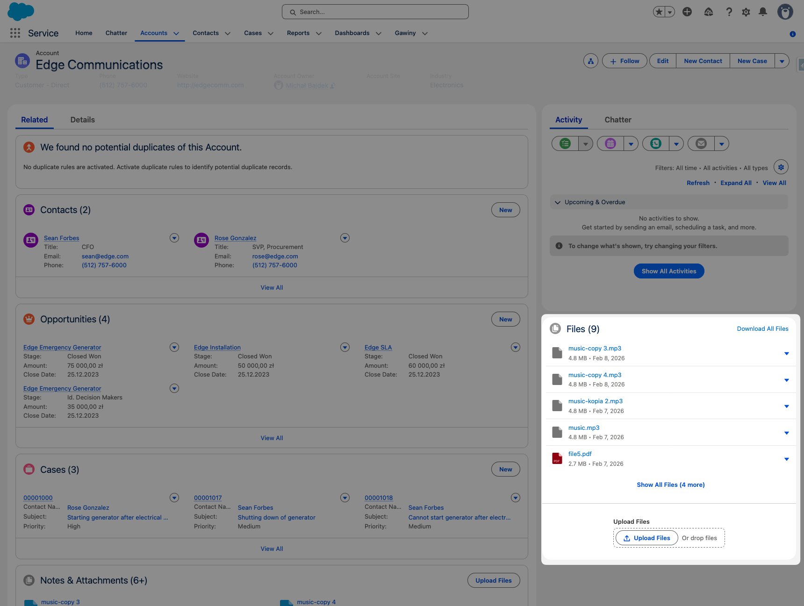

  

# Salesforce Smarter Files

A Lightning Web Component that enhances the native Salesforce file experience on record pages. Drop it onto any record page via Lightning App Builder to get file preview, bulk download as ZIP, per-file actions, and configurable upload restrictions.

## Features

- **List & Tile views** — Switch between a compact list and a visual tile grid, configured per page
- **File preview** — Click any file to open the standard Salesforce file preview
- **Download All as ZIP** — One-click download of all record files into a single ZIP archive (powered by JSZip)
- **Per-file actions** — Dropdown menu on each file with Download, Share, Public Link, View Details, Edit Details, Delete, and Remove from Record
- **Allowed file extensions** — Optionally restrict uploads to specific file types (e.g., `pdf,docx,png`), configured per page by an admin
- **Max file size** — Set a maximum upload size in MB per page
- **Display limit** — Control how many files are shown initially with a "Show All" toggle
- **Custom Labels** — Every user-visible string is stored as a Salesforce Custom Label, allowing admins to customize all text via Setup without touching code

## Deploy to Salesforce

Click the button above to deploy directly to your Salesforce org (Sandbox or Production).

## Documentation

| Guide | Description |
|-------|-------------|
| [Installation](docs/INSTALLATION.md) | Deploy to your org, CLI fallback, post-deploy setup, permissions |
| [Configuration](docs/CONFIGURATION.md) | Component properties, display modes, upload restrictions, deployed components |
| [Architecture](docs/ARCHITECTURE.md) | Project structure, how file display, download, and upload filtering work |

## License

MIT
