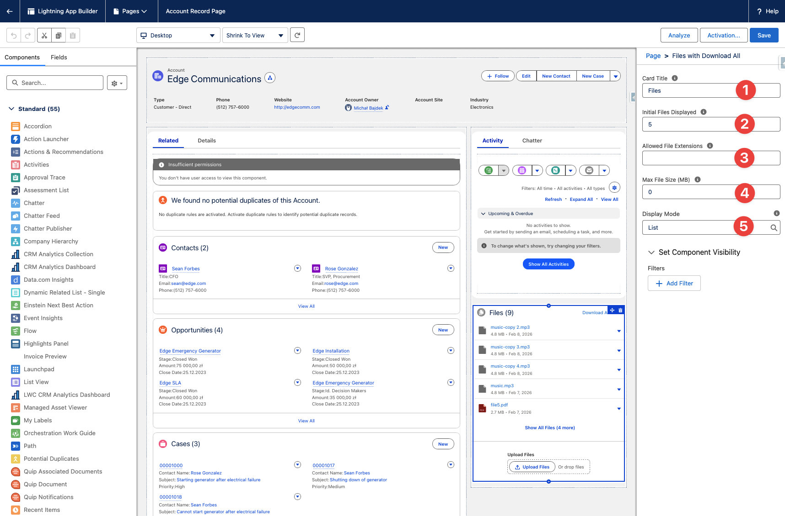
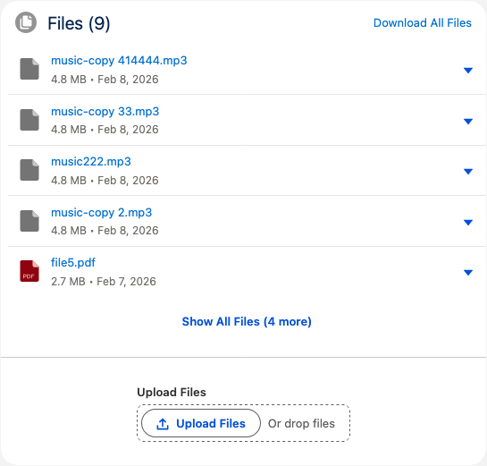
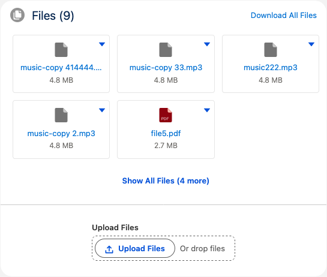

# Configuration Guide

## Component Properties

Open **Lightning App Builder** on any record page to configure the component.



| Property | Type | Default | Description |
|----------|------|---------|-------------|
| Card Title | String | `Files` | Header text displayed on the component card |
| Allowed File Extensions | String | *(empty)* | Comma-separated allowlist of file extensions (e.g., `pdf,docx,png`). Leave empty to allow all types. |
| Initial Files Displayed | Integer | `5` | Maximum number of files shown initially. Set to `0` to show all files. |
| Display Mode | Picklist | `List` | `List` (vertical rows) or `Tiles` (grid of cards) |
| Max File Size (MB) | Integer | `0` | Maximum upload size in megabytes. `0` = no limit. |

## Display Modes

### List

Files are displayed as vertical rows with file name, size, and date.



### Tiles

Files are displayed as a responsive grid of cards with file type icons.



## Extension Format

The parser is flexible. All of these are equivalent:

```
docx,exe,pdf
.docx, .exe, .pdf
DOCX , EXE , PDF
.DOCX,  exe  ,  .Pdf
```

Leading dots are stripped, whitespace is trimmed, and matching is case-insensitive.

## What Gets Deployed

| Category | Components |
|----------|-----------|
| Apex Classes | TucarioFileDownloadController |
| Apex Test Classes | TucarioFileDownloadControllerTest |
| Lightning Web Components | tucarioFilesWithDownloadAll, tucarioLabels |
| Static Resources | TucarioJSZip (3.10.1) |
| Custom Labels | `Tucario_Files_*`, `Tucario_Common_*` |
| Permission Set | Tucario_Files |

## Customizing Displayed Text

All user-visible text (button labels, messages, toast titles) is stored in Salesforce Custom Labels. To customize any text:

1. Navigate to **Setup > Custom Labels**
2. Search for **Tucario** to find all labels
3. Edit the label value and save
4. Refresh the page to see the updated text
