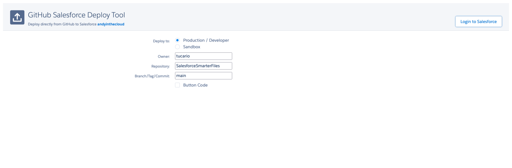
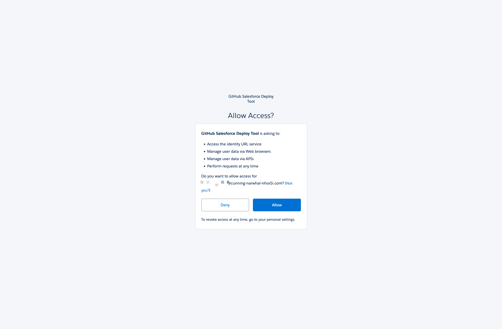
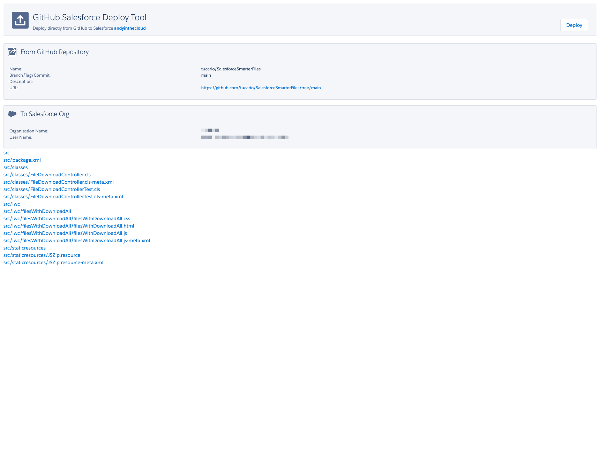

# Installation Guide

## Prerequisites

- Salesforce org with Lightning Experience enabled
- API version 60.0+ (Spring '24 or later)
- "Modify All Data" or equivalent metadata deployment permissions
- Salesforce CLI (`sf`) installed locally (for CLI deployment only)

## One-Click Deploy

[](https://githubsfdeploy.herokuapp.com?owner=tucario&repo=SalesforceSmarterFiles&ref=main)

Click the button to open the GitHub Salesforce Deploy Tool. Follow the three steps below:

### Step 1: Choose your environment

Select **Production** or **Sandbox** and confirm the Owner, Repository, and Branch fields.



### Step 2: Authorize Salesforce access

Log in to your Salesforce org and click **Allow** to authorize the deploy tool.



### Step 3: Review and deploy

Review the list of components to be deployed, then click **Deploy**.



## CLI Deployment

If the one-click deploy tool is unavailable, use the Salesforce CLI:

```bash
sf project deploy start --source-dir src --target-org <your-org-alias>
```

> **Production note:** Production orgs may require Apex test execution during deployment:
>
> ```bash
> sf project deploy start --source-dir src --target-org <your-org-alias> --test-level RunLocalTests
> ```

## Post-Deploy Setup

1. Upload the **TucarioJSZip** static resource (`src/staticresources/TucarioJSZip.resource`) if not already present
2. Open **Lightning App Builder** on any record page
3. Drag the **Files with Download All** component onto the page
4. Configure properties as needed (see [Configuration](CONFIGURATION.md))
5. Save and activate the page
6. Assign the **Tucario Files** permission set to users who need the component (see [Permissions](#permissions) below)

## Permissions

### Option 1: Use the included permission set

1. Navigate to **Setup > Permission Sets**
2. Find **Tucario Files**
3. Assign to users who need the component

### Option 2: Add to your own permission set

If you manage access through your own permission sets, add:

- **Apex Class Access**: `TucarioFileDownloadController` — enabled

### Notes

- System Administrators already have access (implicit Apex class access via "Modify All Data" / "Author Apex")
- Users need standard Files access (included in all standard profiles)
- File visibility is governed by your org's sharing rules
